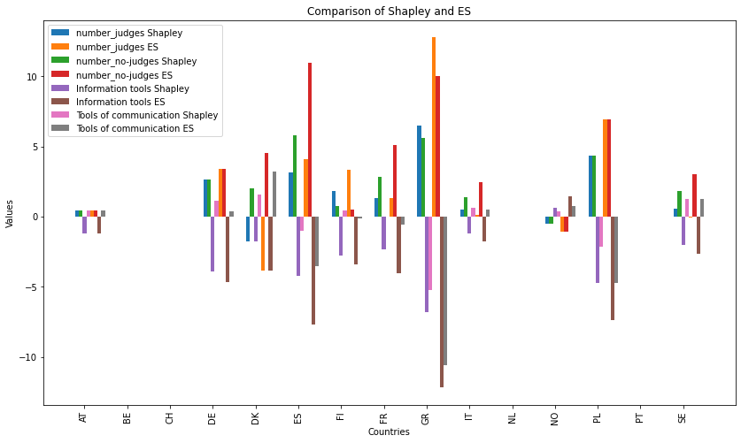

# DEA_Shapley
---
Compute DEA with the directional distance function (DDF) and return Shapley scores for each DMU
---

### DEA_Shapley is a method to fit DDF DEA models with Shapley contributions

In this package, we find:

  * Computation of DDF by DEA with CRS, DRS, VRS, IRS
  * Choose your own direction g for the DDF
  * Computation for one or multi-outputs
  * Shapley contributions
  * Equal Surplus contributions (ES)
  * Feature importance contributions

### Libraries
* numpy
* pandas
* pulp
* matplotlib

```python
pip install pulp
```

### Import Shapley

```python
from Shapley import ShapleyModel
```

### Import data 

```python
# Data
import pandas as pd
import numpy as np
cepej = pd.read_excel('cepej_example.xlsx', index_col=0)
cepej = cepej.dropna()
cepej.head()
```

### Organize the data (X = inputs y = outputs)

```python
y1 = 1000 - cepej['disposition time'].to_numpy() # First output
y2 = cepej['clearance rate'].to_numpy()          # Second output
Y = np.column_stack((y1, y2))
X = cepej[[
       "number_judges",
       "number_no-judges",
       "Information tools",
       "Tools of communication"
       ]].to_numpy()
```

### Parameters of the model

```python
outputs = "multi_dimensions"  # otherwise "one_dimension" to select just one output
g_inputs = np.ones((X.shape[1]))
g_outputs = np.ones((Y.shape[1]))
constraint = "DRS"            # select "VRS" or "CRS" or "IRS"
```

### Instantiate the model

```python
from Shapley import ShapleyModel
model = ShapleyModel(outputs = "multi-outputs", constraint = "DRS", g_inputs = g_inputs, g_outputs = g_outputs)
```

### Compute the DDF by DEA

```python
DDF_results = model.dea_ddf(X,Y)
columns = ["DDF"]
df = pd.DataFrame(DDF_results, columns=columns)
df['Rank'] = df['DDF'].rank(ascending=True)
display(df)
```
|    |          DDF          | Rank |
|----|-----------------------|------|
| 0  | 1.059028e-01          | 8.0  |
| 1  | 1.302850e-11          | 5.0  |
| 2  | 1.227791e-10          | 7.0  |
| 3  | 2.474448e+00          | 14.0 |
| 4  | 1.122606e-11          | 4.0  |
| 5  | 3.753739e+00          | 15.0 |
| 6  | 2.407980e-01          | 9.0  |
| 7  | 1.781102e+00          | 13.0 |
| 8  | 8.546978e-12          | 1.0  |
| 9  | 1.252857e+00          | 10.0 |
| 10 | 9.724485e-12          | 2.0  |
| 11 | 1.593886e-11          | 6.0  |
| 12 | 1.777659e+00          | 12.0 |
| 13 | 9.978950e-12          | 3.0  |
| 14 | 1.562500e+00          | 11.0 |


### Fit the model and choose the attribution method (shapley, ES, permutation)

```python
df = model.fit("shapley",X,Y)  # Otherwise Choose "ES" for equal surplus or "permutation" to compute the feature importance
```

### Print the results
```python
columns = [
       "number_judges",
       "number_no-judges",
       "Information tools",
       "Tools of communication"
       ]
contrib_df = pd.DataFrame(df, index = cepej.index, columns = columns)
row_sums = contrib_df.sum(axis=1)
contrib_pourcentage = contrib_df.div(row_sums, axis=0) * 100
print("Absolute Contributions:", "\n")
display(contrib_df)
print("Contributions (%):", "\n")
display(contrib_pourcentage)
```
Absolute Contributions:

| Country | Number Judges | Number No-Judges | Information Tools | Tools of Communication |
|---------|---------------|------------------|-------------------|------------------------|
| AT      | 4.409449e-01  | 4.409449e-01     | -1.216932e+00     | 4.409449e-01           |
| BE      | 2.790734e-11  | 2.870596e-11     | -2.545989e-11     | -1.812491e-11          |
| CH      | 8.936460e-11  | 4.555474e-11     | -1.740156e-11     | 5.261364e-12           |
| DE      | 2.653543e+00  | 2.653543e+00     | -3.945802e+00     | 1.113164e+00           |
| DK      | -1.790780e+00 | 2.018929e+00     | -1.790780e+00     | 1.562631e+00           |
| ES      | 3.164726e+00  | 5.796762e+00     | -4.216244e+00     | -9.915052e-01          |
| FI      | 1.849820e+00  | 7.504639e-01     | -2.774980e+00     | 4.154935e-01           |
| FR      | 1.333614e+00  | 2.821898e+00     | -2.354738e+00     | -1.967127e-02          |
| GR      | 6.500000e+00  | 5.577444e+00     | -6.824942e+00     | -5.252502e+00          |
| IT      | 4.723775e-01  | 1.400160e+00     | -1.224742e+00     | 6.050617e-01           |
| NL      | 3.479717e-11  | 3.372647e-11     | -3.021005e-11     | -2.858911e-11          |
| NO      | -5.014108e-01 | -5.014108e-01    | 6.200246e-01      | 3.827971e-01           |
| PL      | 4.322842e+00  | 4.322842e+00     | -4.744494e+00     | -2.123531e+00          |
| PT      | 2.968818e-11  | 3.087240e-11     | -3.192201e-11     | -1.865961e-11          |
| SE      | 5.595550e-01  | 1.818898e+00     | -2.041919e+00     | 1.225966e+00           |

Contributions (%):

| Country | Number Judges | Number No-Judges | Information Tools | Tools of Communication |
|---------|---------------|------------------|-------------------|------------------------|
| AT      | 4.163676e+02  | 4.163676e+02     | -1.149103e+03     | 4.163676e+02           |
| BE      | 2.142023e+02  | 2.203321e+02     | -1.954170e+02     | -1.391175e+02          |
| CH      | 7.278484e+01  | 3.710300e+01     | -1.417306e+01     | 4.285226e+00           |
| DE      | 1.072378e+02  | 1.072378e+02     | -1.594619e+02     | 4.498634e+01           |
| DK      | -1.595126e+13 | 1.798348e+13     | -1.595126e+13     | 1.391904e+13           |
| ES      | 8.430863e+01  | 1.544264e+02     | -1.123212e+02     | -2.641380e+01          |
| FI      | 7.682041e+02  | 3.116570e+02     | -1.152410e+03     | 1.725486e+02           |
| FR      | 7.487574e+01  | 1.584355e+02     | -1.322068e+02     | -1.104444e+00          |
| GR      | 7.605060e+13  | 6.525661e+13     | -7.985245e+13     | -6.145476e+13          |
| IT      | 3.770401e+01  | 1.117574e+02     | -9.775592e+01     | 4.829455e+01           |
| NL      | 3.578305e+02  | 3.468201e+02     | -3.106596e+02     | -2.939910e+02          |
| NO      | -3.145871e+12 | -3.145871e+12    | 3.890059e+12      | 2.401684e+12           |
| PL      | 2.431761e+02  | 2.431761e+02     | -2.668956e+02     | -1.194566e+02          |
| PT      | 2.975081e+02  | 3.093752e+02     | -3.198935e+02     | -1.869897e+02          |
| SE      | 3.581152e+01  | 1.164094e+02     | -1.306828e+02     | 7.846184e+01           |


### Comparison with ES
```python
df_ES = model.fit("ES",X,Y)
contrib_df_ES = pd.DataFrame(df_ES, index = cepej.index, columns = columns)
```

### Plot
```python
import matplotlib.pyplot as plt
fig, ax = plt.subplots(figsize=(14, 8))
width = 0.35  
countries = cepej.index
for i, input in enumerate(columns):
    bar1 = ax.bar(np.arange(len(countries)) - width/2 + i*(width/4), contrib_df[input], width/4, label=f'{input} Shapley')
    bar2 = ax.bar(np.arange(len(countries)) + width/2 + i*(width/4), contrib_df_ES[input], width/4, label=f'{input} ES')
ax.set_xlabel('Countries')
ax.set_ylabel('Values')
ax.set_title('Comparison of Shapley and ES')
ax.set_xticks(np.arange(len(countries)))
ax.set_xticklabels(countries, rotation=90)
ax.legend()
plt.show()
```


